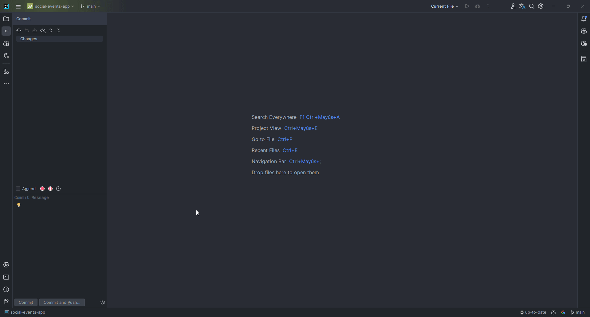

# Gitmoji - Desktop app

## How to use

- Press `Alt + G` to open the Gitmoji menu.
- Search for a Gitmoji, use `Tab` to navigate through the list and press `Enter` or click on it.
- The Gitmoji will be pasted in the current active window.
- On settings:
    1. You can set the shortcut to open the Gitmoji menu.
    2. You can also set the gitmoji output style, the default is `code` style.

